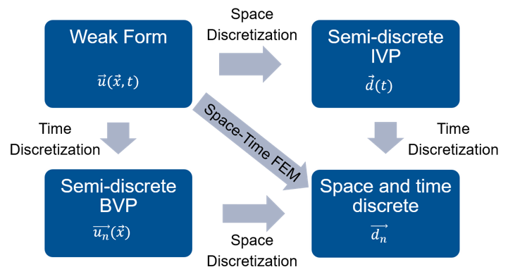
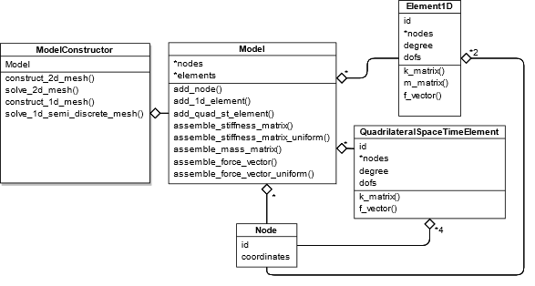

# Space-Time Finite Element Method
This project is part of the Software Lab course project for Computational
Mechanics studies in the Technical University of Munich.

### Authors
* **[Mahmoud Zidan](https://gitlab.lrz.de/ga53zaf)**
* **[Gabriela Loera](https://gitlab.lrz.de/ga86zax)**
* **[Mahmoud Ammar](https://github.com/MahmoudAmmar-96)**

### Supervisors
* **[Mohamed Elhaddad](https://gitlab.lrz.de/ga73gix)**
* **[Philipp Kopp](https://gitlab.lrz.de/ga49sos)**

## Introduction
Space-Time Finite Element Method is an alternative to the semi-discrete
approach using a time integration scheme for solving transient partial
differential equation (e.g. the heat equation). The difference to the semi-discrete
approach is that the time is considered as a dimension and the weak form
is formulated accordingly. The shape functions are a tensor product of the
spatial shape functions and the temporal shape function (e.g. the 1d problem
has 2d finite elements with x(space) and t(time) dependencies).


### Advantages of Space-Time FEM:
* Using high-order basis functions for space and time discretization leads to an approximation with a higher accuracy
* Offers the possibility of exploitation of HPC.
* Allows local refinement in space and time.

## This Project
This project shows an implementation of the Space-Time Finite Element Method to solve a transient heat diffusive problem. The implemented program is a stand-alone object-oriented Python code, which solves a problem in semi-discrete approach or using the Space-Time Finite Element Method (STFEM).

## Theory
The transient heat equation being solved is as follows:

)

where T is the temperature, c is the heat capacity, and κ is the heat conductivity. The conventional semi-discrete approach would be, after discretizing and applying the weak form,

&space;\hat{T}_i^{k&plus;1}&space;=&space;\left(&space;\frac{c}{\Delta&space;t}&space;M_{ij}&space;-&space;(1-\theta)K_{ij}&space;\right)&space;\hat{T}_i^k&space;&plus;&space;(1&space;-&space;\theta)&space;f_i^k&space;&plus;&space;\theta&space;f_i^{k&plus;1},)

where  is the discretized temperature field, $`M_{ij}=\int{N_i N_j}`$ and $`K=\int{N_{i,x} N_{j,x}}`$ are the system matrices, and $`0 \leq \theta \leq 1`$ is a time integration scheme parameter. On the other hand, the space-time approach would be simply solving $`K_{ij} \hat{T}_i = F_i`$ on a 2D mesh, where the two dimensions are the spatial and the temporal axes, and
```math
K_{ij} = c \int_t{ \int_x{ \frac{\partial N_i}{\partial t} N_j ~dxdt } } ~+~ \kappa \int_t{ \int_x{ \frac{\partial N_i}{\partial x} \frac{\partial N_j}{\partial x} ~dxdt } }.
```

## Code Structure


## Examples
### Semi-Discrete
```python
import numpy as np
pi = np.pi
sin = np.sin
cos = np.cos

from FE_code.model_constructor import ModelConstructor

def f(x, t):
    return 2*pi*cos(2*pi*t)*sin(2*pi*x) + 4*pi*pi*sin(2*pi*t)*sin(2*pi*x)

def u_an(x, t):
    return sin(2*pi*x)*sin(2*pi*t)

timesteps=100
time=1
dt = time / timesteps

model = ModelConstructor(degree=1)
model.construct_1d_semi_discrete_uniform_mesh(
    length = 1,
    elements = 20,
    c = 1,
    kappa = 1,
    f = f,
    theta = 1,
    dt = dt,
    timesteps = timesteps,
)
model.solve_1d_semi_discrete_uniform_mesh(print_info=True)
model.transient_plot_semi_discrete()
```

### Space-Time FEM
```python
import numpy as np
pi = np.pi
sin = np.sin
cos = np.cos

from FE_code.model_constructor import ModelConstructor

def f(x, t):
    return 2*pi*cos(2*pi*t)*sin(2*pi*x) + 4*pi*pi*sin(2*pi*t)*sin(2*pi*x)

def u_analytical(x, t):
    return sin(2*pi*x)*sin(2*pi*t)


model = ModelConstructor(degree=1)
model.construct_2d_uniform_mesh(
    length_x = 1,
    length_t = 1,
    c = 1,
    kappa = 1,
    elements_x = 100,
    elements_t = 100,
    f = f,
)
model.solve_2d_uniform_mesh(print_info=False)
model.plot_solution_3d()
```

## More Tasks to do
* [x] A framework to solve the transient heat equation in 1D using:
    * [x] Semi-Discrete Approach
    * [x] Space-Time FEM
* [ ] Extension to higher dimensions
* [ ] Partitioned STFEM solver to reduce the computational effort
* [ ] Non-uniform mesh to allow local time refinement
